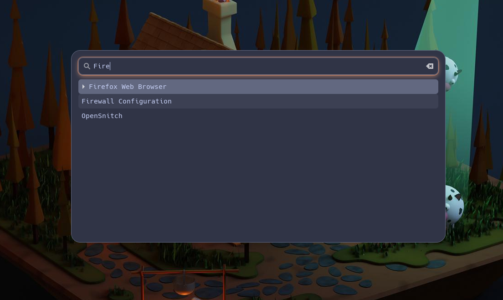

# A Wofi Catppuccin Theme

a wofi catppuccin theme

## Screenshot

## Installation

Copy the style.css file to `~/.config/wofi/style.css`. Restart wofi.

## Acknowledgments

Thanks to the folks of [catppuccin](https://github.com/catppuccin/catppuccin)!
